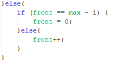
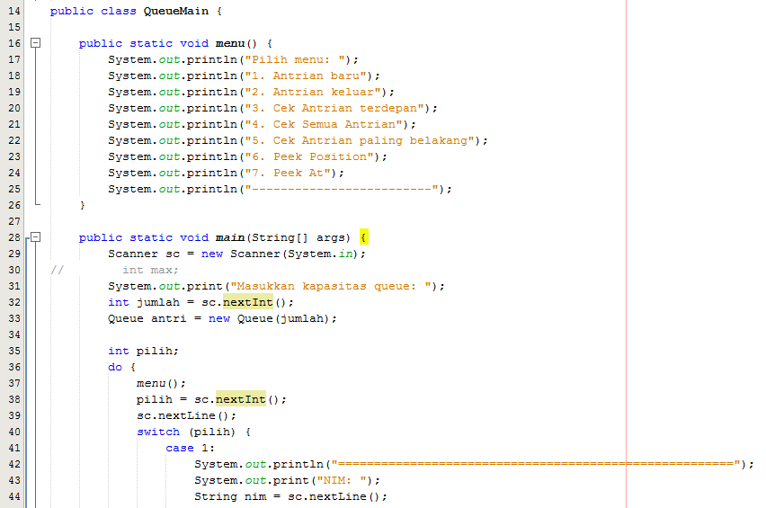
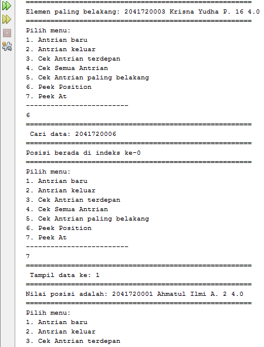

# Laporan Jawaban Jobsheet 8 
## Pertanyaan 8.2.3
1.	Atribut front dan rear diinisialisasi dengan nilai – 1 dan bukan 0, karena tidak menunjuk ke data manapun.
2.	Maksud dari potongan kode program tersebut adalah kondisi untuk mengecek apakah posisi REAR berada pada indeks terakhir array. Jika benar, maka posisi REAR selanjutnya adalah di indeks 0.
3.	 kode program yang menunjukkan bahwa 
data baru disimpan pada posisi terakhir di dalam queue
* 
4.	 baris kode program yang menunjukkan bahwa 
data yang dikeluarkan adalah data pada posisi paling depan di dalam queue
* 
5.	Kegunaan potongan kode program tersebut adalah untuk melakukan pengecekan apakah posisi FRONT saat ini berada di indeks terakhir array. Jika benar, maka FRONT selanjutnya diletakkan di indeks 0.
6.	Pada method print, proses perulangan variabel i tidak dimulai dari 0 (int i = 0) melainkan int i = front karena perulangan akan melakukan looping semua isi array mulai dari indeks front sampai indeks rear dan front tidak selalu pada indeks ke 0, makanya tidak dituliskan int i = 0 melaikan int i = front, karena belum tentu front itu berada pada indeks 0.
7.	Potongan kode program tersebut untuk melakukan proses dimana i yaitu front ditambah 1 lalu dimodulus dengan max selama bukan 0 maka proses tersebut akan terus dijalankan dengan perulangan.
#
## Pertanyaan 8.3.3
1.	Digunakan untuk instansiasi.
2.	Akan terjadi error, karena konstruktor dari class Penumpang tidak ada yang tidak berparameter
3.	 kode program yang digunakan untuk menampilkan data yang dikeluarkan dari queue
* 
4.	 modifikasi program dengan menambahkan method baru bernama peekRear pada class 
Queue yang digunakan untuk mengecek antrian yang berada di posisi belakang! Tambahkan pula 
daftar menu 5. Cek Antrian paling belakang pada class QueueMain sehingga method peekRear 
dapat dipanggil.
* 
* 
#
# Praktikum Jobsheet 8 (Algoritma & Struktur Data)
## Gambar berikut memuat kodingan class objek, class main dan output
#
1. * Class Queue
    
    * Class Queue Main
    
    
    * Output Queue
    
    
    
#
2. * Class Mahasiswa
    
    * Class Queue Antrian Mahasiswa
    
    
    
    
    
    
    * Class Main Queue Antrian Mahasiswa
    
    
    
    * Output Queue Antrian Mahasiswa
    
    
    
    
#