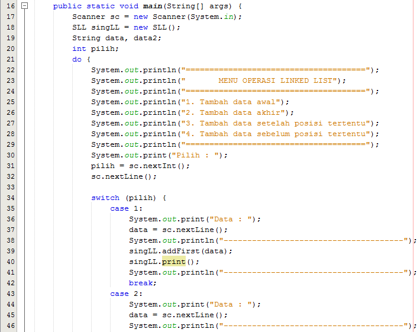
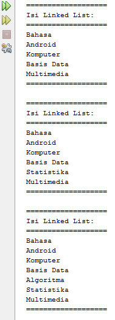

# LAPORAN TUGAS JOBSHEET 03
# Iftitah Hidayati /1H/14/2041720006
## Pertanyaan 9.2.3
1.	Karena sebelumnya tidak ada penambahan data pada node
2.	Kode yang pertama gunanya untuk mengenalkan objek baru bahwa nilai setelahnya adalah temp.next tersebut. Kemudian baris kedua untuk memberikan pointer pada temp.next dari yang dicari.
3.	Kode tersebut digunakan untuk mengetahui apakah nilai setelah data baru yang disisipkan bernilai null. Jika iya maka data baru tersebut akan menjadi data terakhir atau tail.
#
## Pertanyaan 9.3.3
1.	Untuk menghentikan proses looping jika kondisi telah terpenuhi. Sehingga tidak perlu melakukan proses looping sampai data paling akhir.
2.	Baris pertama digunakan untuk mengecek apakah data setelah temp.next sama dengan data yang diinginkan maka temp.next akan melewati satu data setelahnya. Sehingga data setelahnya terhapus.
3.	Kembalian yang pertama adalah -1 jika data yang dicari tidak ada atau tidak ditemukan.
Kembalian yang kedua adalah nilai indeks jika data ditemukan.
#
# Praktikum Jobsheet 8 (Algoritma & Struktur Data)
## Gambar berikut memuat kodingan class objek, class main dan output
#
1. * Class Node
    
    * Class SLL
    
    
    
    
    
    
    * Class SLL Main
    
    * Output No 1
    
#
2. * Class Node
    
    * Class SLL
    
    
    
    
    * Class SLL Main
    
    
    * Output No 2
    
    
#
3. * Class Node
    
    * Class SLL
    
    
    
    * Class SLL Main
    
    * Output No 3
    
    
    
#
4. * Class Node
    
    * Class Nasabah
    
    * Class SLL
    
    
    
    
    
    
    * Class SLL Main
    
    
    
    
    * Output No 4
    
    
    
    
    
    
    
#
5. * Class Node
    
    * Class SLL
    
    
    
    * Class SLL Main
    
    
    
    * Output No 5
    
    
    
    
    
#