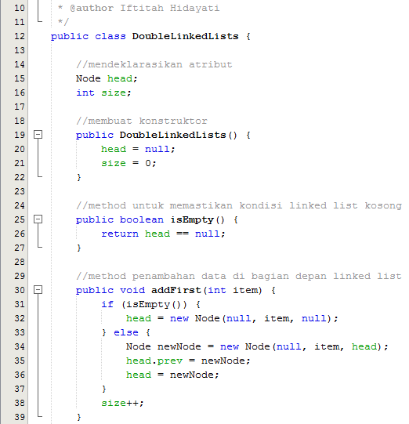
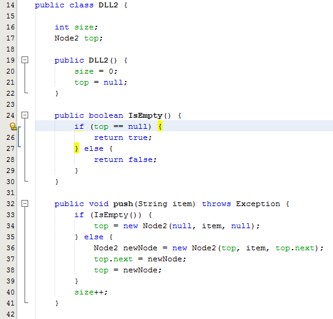
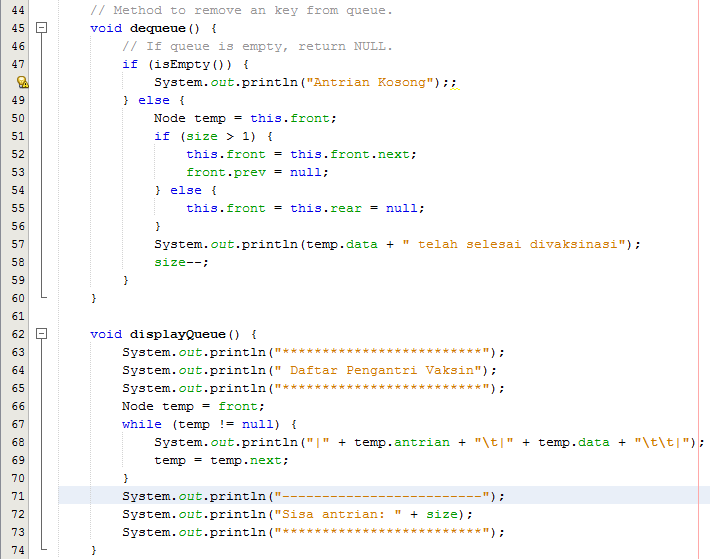

# LAPORAN TUGAS JOBSHEET 12
# Iftitah Hidayati /1H/14/2041720006
## Pertanyaan 12.2.3
1.	Pada single linked list hanya memiliki satu pointer saja yaitu next, sedangkan pada double linked list memiliki dua pointer yaitu next dan previous, dimana pointer merujuk pada node berikutnya dan pointer previous merujuk pada node sebelumnya.
2.	Pointer next digunakan untuk menunjuk node setelahnya dan pointer previous menunjuk node sebelumnya.
3.	Untuk mengeset atau sebagai nilai awal/defautl bahwa nilai dari head = null karena belom ada data awal dan size = 0 karena belum ada panjang/kapasitas kumpulan node yang diisi.
4.	Karena pada addFirst atau penambahan data pertama itu tidak ada pointer prev atau pointer sebelumnya karena node itu sendiri merupakan node pertama,yang mana hanya memilki pointer next.
5.	Mengenalkan pointer previous pada node baru
6.	Mengenalkan node baru pada pointer tail.
#
## Pertanyaan 12.3.3
1.	Pada baris pertama digunakan untuk mengubah posisi head dan node setelahnya. Kemudian baris kedua digunakan untuk menghapus head sebelumnya dengan memberikan nilai null.
2.	Terdapat 2 kondisi. Kondisi yang pertama mengecek apakah setelah head bernilai null jika benar maka head langsung dihapus. Kondisi kedua dilakukan looping dengan cara mengecek apakah dua node setelah current bernilai null. Kemudian setelah keluar looping node current.next diberikan nilai null.
3.	Baris pertama digunakan untuk pembuatan node temp untuk menyimpan lokasi node setelah head. Baris kedua digunakan mengahapus hubungan nodehead dengan node temp dengan cara langsung menghubungkan head.next kepada node telah temp. Baris ketiga menghapus hubungan node setelah temp dengan temp dengan cara langsung menghubungkan node setalah temp dengan node head.
4.	Baris pertama digunakan mengahapus hubungan current dengan node sebelumnya dengan cara langsung menghubungkan node sebelum current kepada node setelah current. Baris kedua menghapus hubungan node setelah current dengan current dengan cara langsung menghubungkan node setelah current dengan node sebelum current.
#
## Pertanyaan 12.4.3
1.	Digunakan untuk mengetahui total node yang ada didalam list.
2.	Caranya dengan mengubah head menjadi head.next sehingga, nanti head akan berada pada index ke-1 dan index ke-0 akan dikosongkan.
3.	Double linked lists perlu mengetahui node sebelum dan sesudahnya, sedangkan single linked lists hanya mengetahui node setelahnya saja.
4.	Kode program isEmpty() yang A mengecek menggunakan  jumlah node yang ada dilinked list. Kode program isEmpty() yang B melakukan pengecekan berdasarkan nilai pada headnya.
#
# Praktikum Jobsheet 12 (Algoritma & Struktur Data)
## Gambar berikut memuat kodingan class objek, class main dan output
#
1. * Class Node
    
    * Class Double Linked Lists
    
    
    
    
    
    
    
    * Class Main
    
    
    
    * Output No 1
    
    
    
    
    
    
    
    
    
    
#
2. * Class Node
    
    * Class Double Linked Lists
    
    
    
    * Class Main
    
    
    * Output No 2
    
    
    
    
    
#
3. * Class Node
    
    * Class Node
    
    
    * Class Double Linked Lists
    
    
    * Class Main
    
    
    * Output No 3
    * 
    
    
    
    
#
4. * Class Node
    
    * Class Mahasiswa
    
    * Class Double Linked Lists
    
    
    
    
    
    
    
    
    * Class Main
    
    
    
    
    
    * Output No 1
    
    
    
    
    
    
    
    
    
    
#