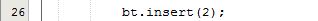
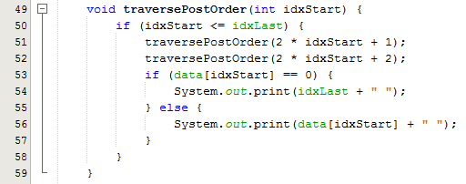

# LAPORAN TUGAS JOBSHEET 12
# Iftitah Hidayati /1H/14/2041720006
## Pertanyaan 12.3.3
1.	Karena proses pencarian pada binary search tree prosesnya dilakukan dengan membandingkan data yang dicari mulai dari data dari root hingga ke sub root berikutnya. Jadi hal ini menyebabkan binary search tree lebih efektif daripada search tree biasa.
2.	Digunakan untuk percabangan dimana left sebagai penyimpanan nilai terkecil dan right sebagai penyimpanan nilai terbesar dari nilai node itu sendiri.
3.	*  Sebagai acuan atau patokan yang dijadikan parents node.
    * Rootnya yaitu null atau data yang sudah diinputnya.
4.	Node tersebut akan menjadi root.
5.	Baris program tersebut digunakan sebagai pembanding nilai dari node baru apakah lebih kecil dari node saat ini, jika benar maka ada 2 kondisi pengecheckan lagi yaitu apakah node current.left tidak null maka current.left menjadi pointer, jika tidak node baru ditempatkan di current.left.
#
## Pertanyaan 13.3.2
1.	Atribut data digunakan sebagai nilai arraynya itu sendiri dan idxLast sebagai patokan banyaknya indeks angka yang akan digunakan sebagai binary tree.
2.	Method populateData() digunakan untuk mengambil nilai data dari array dan mengambil batasan indeks array yang digunakan membuat binary tree.
3.	traverseInOrder() digunakan untuk melakukan penelusuran seluruh node pada binary tree dengan metode penelusuran order.
4.	Posisi left child adalah 3 dan posisi right child adalah 4.
5.	Digunakan untuk menentukan jumlah indeks array yang akan ditampilkan.
#
# Praktikum Jobsheet 14 (Algoritma & Struktur Data)
## Gambar berikut memuat kodingan method pada class objek, class main dan output
#
1. * Method Add dengan Rekursif pada class BINARY TREE
    
    * Class Main
    
    * Output No 1
    
#
2. * Method Min dan Max pada class BINARY TREE
    
    * Class Main
    
    * Output No 2
    
#
3. * Method menampilkan data di leaf pada class BINARY TREE
    
    * Class Main
    
    * Output No 3
    
#
4. * Method menampilkan jumlah leaf pada class BINARY TREE
    
    * Class Main
    
    * Output No 4
    
5. Modifikasi class BINARY TREE dan tambahkan:
    * Method add(int data) untuk memasukkan data ke tree
    
    * Method traversalPreOrder() dan traversalPostOrder() ke tree
    
    
    * Class Main
    
    * Output No 5
    
