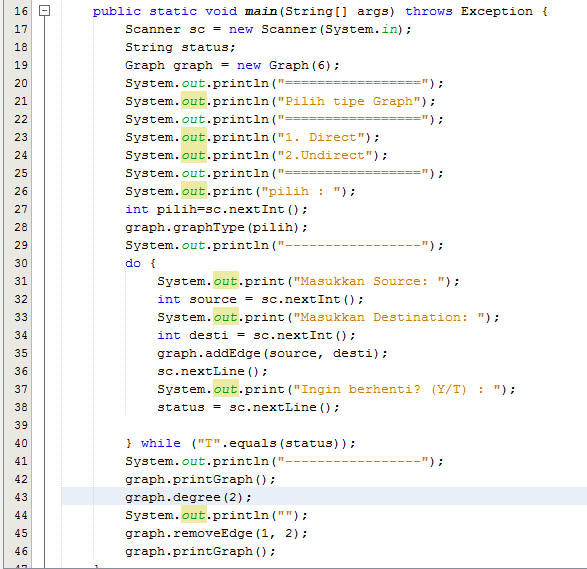
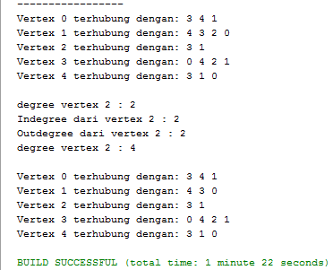

# LAPORAN TUGAS JOBSHEET 12
# Iftitah Hidayati /1H/14/2041720006
## Pertanyaan 12.2.3
1.	Sebutkan beberapa jenis (minimal 3) algoritma yang menggunakan dasar Graph, dan apakah kegunaan algoritma-algoritma tersebut?
Jawab :
a.	Algoritma Brent untuk menentukan adanya daur ulang dalam graph
b.	Algoritma Johnson untuk menemukan lintasan terpendek
c.	Algoritma Hungaria untuk perjodohan sempurna

2.	Pada class Graph terdapat array bertipe LinkedList, yaitu LinkedList list[]. Apakah tujuan pembuatan variabel tersebut ?
Jawab : 
Variabel tersebut digunakan untuk memanggil class Linkedlist.

3.	Apakah alasan pemanggilan method addFirst() untuk menambahkan data, bukan method add jenis lain pada linked list ketika digunakan pada method addEdge pada class Graph?
Jawab :
Karena penambahan method add membutuhkan 2 inputan yaitu index dan data sedangkan method addLast maka urutan edge akan terbalik.

4.	Bagaimana cara mendeteksi prev pointer pada saat akan melakukan penghapusan suatu edge pada graph ?
Jawab :
Ketika i = destination maka akan dilihat source dari i, lalu priver dari i akan dihapus.

5.	Kenapa pada praktikum 12.2 langkah ke-12 untuk menghapus path yang bukan merupakan lintasan pertama kali menghasilkan output yang salah ? Bagaimana solusinya ?
Jawab :
Karena proses pada method removeEdge menghapus berdasarkan indeks list yang ada pada source bukan nilai dari destinationnya. Solusinya adalah mencari nilai indeks pada source yang sama dengan destination, kemudian indeks yang ditemukan tersebut digunakan untuk menghapus edge.
#
## Pertanyaan 12.2.3
1.	Apakah perbedaan degree/derajat pada directed dan undirected graph?
Jawab :
Directed graph, jika ada 2 edge saling berhubungan derajat akan dihitung sedangkan Undirected graph edge hanya dihitung 1.

2.	Pada implementasi graph menggunakan adjacency matriks. Kenapa jumlah vertices harus ditambahkan dengan 1 pada indeks array berikut?
Jawab :
Karena nilai indeksnya dimulai dari 0.

3.	Apakah kegunaan method getEdge() ?
Jawab :
Method getEdge() digunakan untuk menampilkan suatu lintasan.

4.	Termasuk jenis graph apakah uji coba pada praktikum 12.3 ?
Jawab : 
Directed graph

5.	Mengapa pada method main harus menggunakan try-catch Exception ?
Jawab :
Untuk menangani error di Java, digunakan sebuah statement yang bernama try.... catch. Statement tersebut untuk mengurung eksekusi yang menampilkan error dan dapat membuat program tetap berjalan tanpa dihentikan secara langsung. Error yang ditangani oleh try.... catch bisa disebut dengan Exception.
#
# Praktikum Jobsheet 14 (Algoritma & Struktur Data)
## Gambar berikut memuat kodingan method pada class objek, class main dan output
#
1. Ubahlah lintasan pada praktikum 12.2 menjadi inputan! 
    * Class Main yang diubah untuk menjadi inputan
    
    * Output No 1
    
    
#
2. Tambahkan method graphType dengan tipe boolean yang akan membedakan graph termasuk directed atau undirected graph. Kemudian update seluruh method yang berelasi dengan method graphType tersebut (hanya menjalankan statement sesuai dengan jenis graph) pada praktikum 12.2 
    * Method graphType pada class Graph()
    
    
    
    * Class Main
    
    * Output No 2
    
    
#
3. Modifikasi method removeEdge() pada praktikum 12.2 agar tidak menghasilkan output yang salah untuk path selain path pertama kali! 
    * Method removeEdge() pada class Graph
    
    * Class Main
    
    * Output No 3
    
#
4. Ubahlah tipe data vertex pada seluruh graph pada praktikum 12.2 dan 12.3 dari Integer menjadi tipe generic agar dapat menerima semua tipe data dasar Java! Misalnya setiap vertex yang awalnya berupa angka 0,1,2,3, dst. selanjutnya ubah menjadi suatu nama daerah seperti Malang, Surabaya, Gresik, Bandung, dst.
    * Class Node
    
    * Class Linked List
    
    
    
    
    
    
    * Class Graph
    
    
    
    * Class Main
    
    * Output No 4
    
#