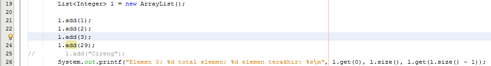
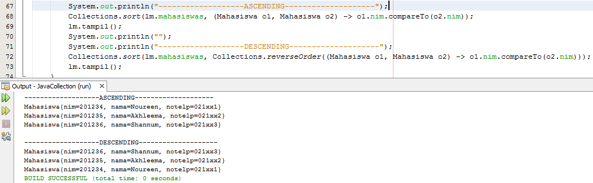
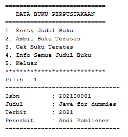
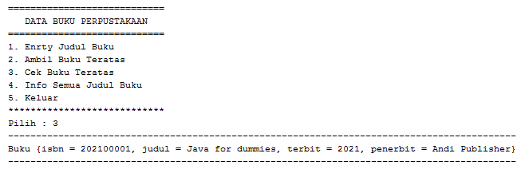

# LAPORAN TUGAS JOBSHEET 16
# Iftitah Hidayati /1H/14/2041720006
## Pertanyaan 16.2.3
1.	Karena arrayList dapat menampung tipe data apa saja, jika tidak disebutkan secara spesifik tipe datanya setelah diinstansiasi.
2.	Yang harus diubah instansiasi pada baris kode no 25. 
    * 
3.	
4.	
5.	Penambahan kode program tersebut menambahkan data “Mei-mei” yang ditambahkan pada list pertama karena method yang digunakan adalah push, dimana data list yang dimasukkan akan ditaruh di posisi list pertama.
#
## Pertanyaan 16.3.3
1.	Jika method push() terdapat pada interface stack, sedangkan method add() terdapat pada arrayList dimana arrayList adalah sub-interface dari interface List.
2.	Data pada list stack fruitsnya kosong sehingga tidak ada data yang ditampilkan. 
    *  
3.	Digunakan untuk mengakses dan menampilkan semua data yang ada pada stack fruits beserta tambahan method lain yang didefinisikan dalam interface Iterator.
4.	Akan terjadi error karena tidak ada import java.util.List dalam kode program tersebut.
    * 
5.	Jawaban no 5
    * 
6.	Jawaban no 6
    * 
#
## Pertanyaan 16.4.3
1.	Fungsi tambah() menggunakan unlimited argument berparameter, kelebihannya dapat menginputkan berbagai jumlah parameter berdasarkan tipe data, selain itu kelebihannya juga dapat menerima nilai pada parameter tanpa ada batasnya.
2.	* Class MhsComparator
        
    * Class ListMahasiswa
        
    * Outuput modif no 2
        
3.	Jawaban no 3
    * 
#
# Praktikum Jobsheet 16 (Algoritma & Struktur Data)
## Gambar berikut memuat kodingan class objek, class main dan output
#
1. * Class StackBuku
    
    * Class Main
    
    
    
    * Output No 1
    
    
    
    
#
2. * Class Mahasiswa
    
    * Class Nilai
    
    * Class Mata Kuliah
    
    * Class Main
    
    
    
    
    
    
    * Output No 2
    
    
    
    
#

