# Jawaban latihan praktikum jobsheet 02

## sub bab 2.2.
   3. Tidak bisa karena tidak ada psvm (public static void main)

## sub bab 2.2.3 
1.	– Memiliki suatu data atau atribut 
– Bisa melakukan method atau suatu tingkah laku 
2.	Class 
3.	Ada 4 atribut, yaitu namaBarang, jenisBarang, stok, hargaBarang yang terletak pada baris ke 13 dan 14
4.	Ada 4 method, yaitu void tampilBarang, void tambahStok, void kurangiStok dan int hitungHargaTotal
    -	Method tampilBarang pada baris 16 sampai 21
    -	Method tambahStok pada baris 23 sampai 25
    -	Method kurangiStok pada baris 27 sampai 29
    -	Method hitungHargaTotal pada 31 sampai 33
5.	Modifikasinya :
void kurangiStok(int n) {
if (stok>0 && stok>n) {
            stok -= n;
}else 
            System.out.println("Stok Habis");
}
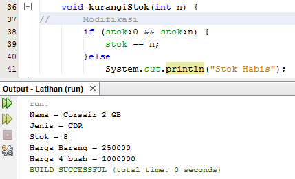
6.	Karena atribut stok sendiri bernilai int sehingga parameternya juga menggunakan int.
7.	Karena method ini menampilkan nilai berupa nominal uang sehingga hasil yang diharapkan tidak memiliki nilai pecahan.
8.	Karena method tersebut tidak mengembalikan nilai sehingga menggunakan void pada method tambahStok().

## sub bab 2.3.3
1.	Baris ke 15, nama objeknya bl
2.	
    *  Membuat kelas objeknya dulu dari kelas Barang dan diberikan nama bl.
    *  Kemudian bisa diakses semua atribut dan method dari class Barang. Cara mengaksesnya pada baris ke 16-21
## sub bab 2.4.2
1. Deklasi konstruktor pada class Barang dilakukan pada baris 25
2.	Memberikan nilai atribut pada class Barang.
3. 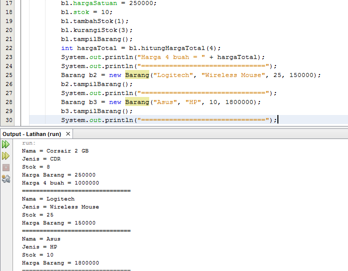

#
# Tugas Praktikum Pertemuan 2
### Disini memuat gambar codingan objek, codingan main dan output dari codingan tersebut

#
1. Codingan objek No 1
    * 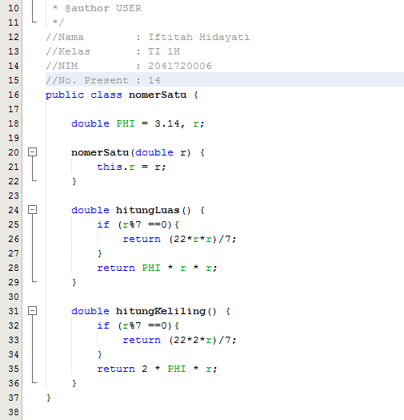
   Codingan Main No 1
    * 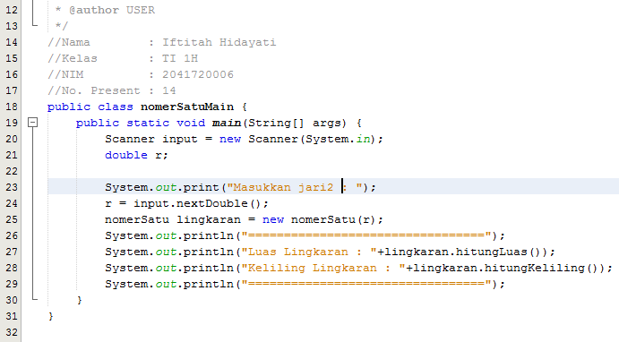
    Output Praktikum No 1
    * 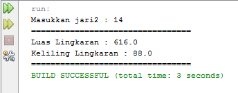
    # 
2. Codingan objek No 2
    * 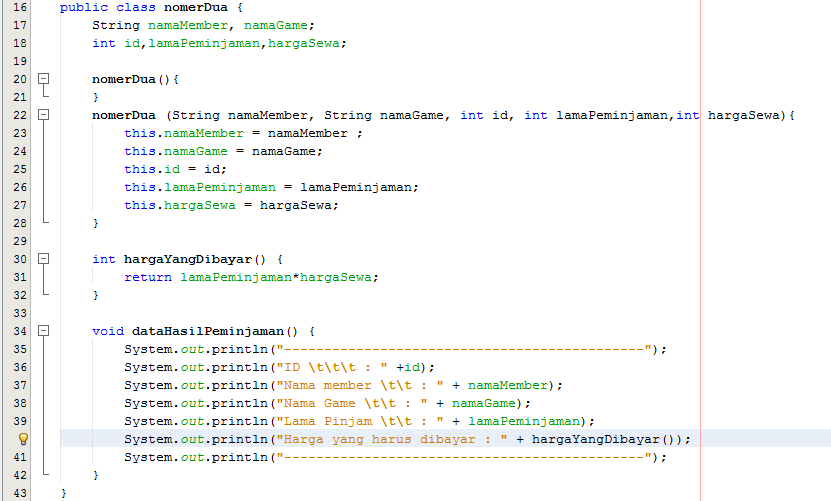
   Codingan Main No 2
    * 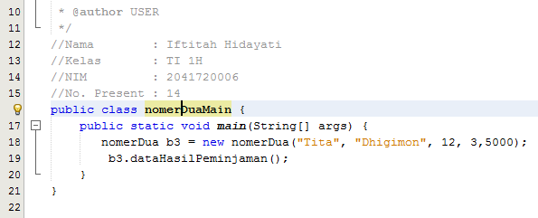
    Output Praktikum  No 2
    * 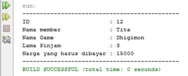
    #
3. Codingan objek No 3
    * 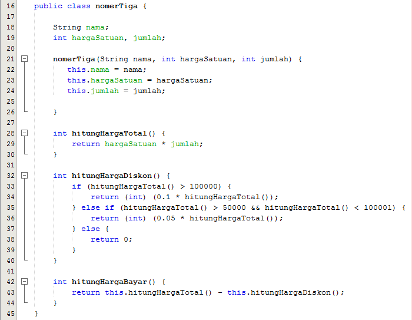
   Codingan Main No 3
    * 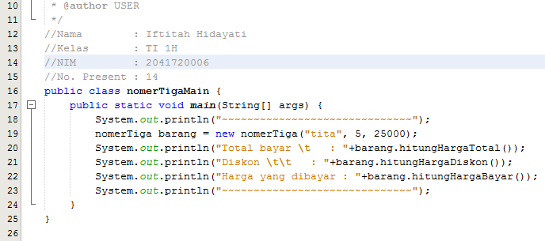
    Output Praktikum No 3
    * 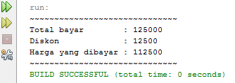
    # 
4. Codingan objek No 4
    * 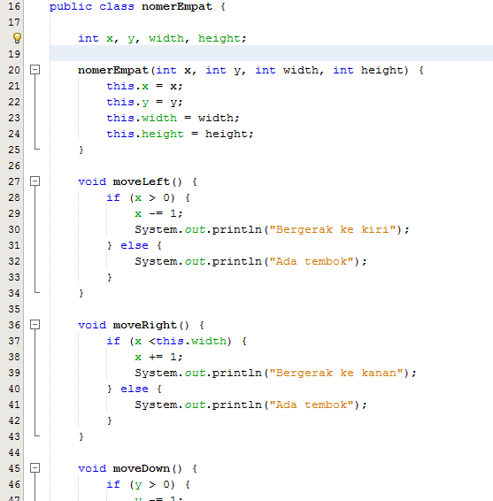
    * 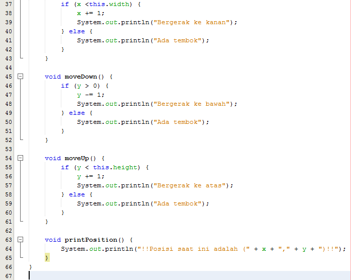
   Codingan Main No 4
    * 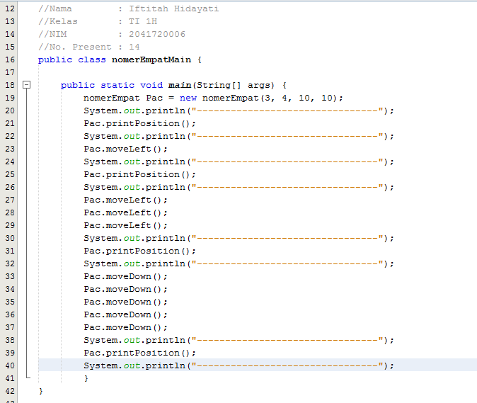
    Output Praktikum No 4
    * 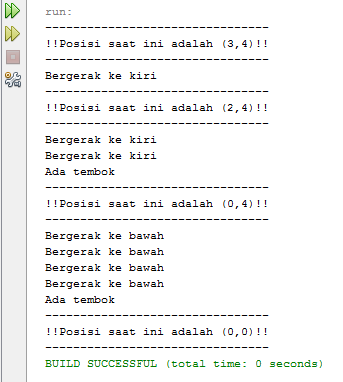
    #
Terimakasih