# LAPORAN TUGAS JOBSHEET 03
# Iftitah Hidayati /1H/14/2041720006
## SUB  3.2.3

1.	Iya perlu, karena jika class pada array objek tidak terdapat atribut maka tidak ada yang diproses, begitu pula jika tidak ada method maka tidak ada prosesnya. Jadi atribut dan method itu satu kesatuan dalam class array objek.
2.	Tidak, karena konstruktor tersebut digunakan untuk menyimpan inputan panjangPersegi pada indeks array yang telah ditentukan (indeks 1 pada soal)
3.	Kode seperti itu digunakan untuk membuat array dari objek PersegiPanjang, caranya hampir sama seperti membuat array biasa.
4.	Kode tersebut digunakan untuk mengisi sebuah persegi panjang berupa panjang dan lebar yang dimana disimpan dalam array indeks ke 1 pada soal.
5.	Iya harus dipisahkan, karena objek adalah sesuatu yang nyata dan main hanya program untuk menampilkan dari objek classnya.
## SUB 3.3.3
1.	Iya dapat
2.	Contohnya yaitu pada pembelian kain. Dimana ada 2 array, untuk array yang pertama digunakan untuk menginputkan panjang dan lebar dan array yang kedua digunakan untuk menginputkan harga per meter dan jumlah kain.
3.	Jika seperti kode tersebut maka akan terjadi error NullPointerException, error itu terjadi karena belum terinstansiasi ke objek array yang indeks keberapa. Itu terjadi karena kita hanya mendeklarasikan sebuah variabel, tetapi tidak membuat sebuah objek. Jadi kita hanya menunjuk ke sesuatu yang sebenarnya tidak ada.
4.  Modifikasi No 4
	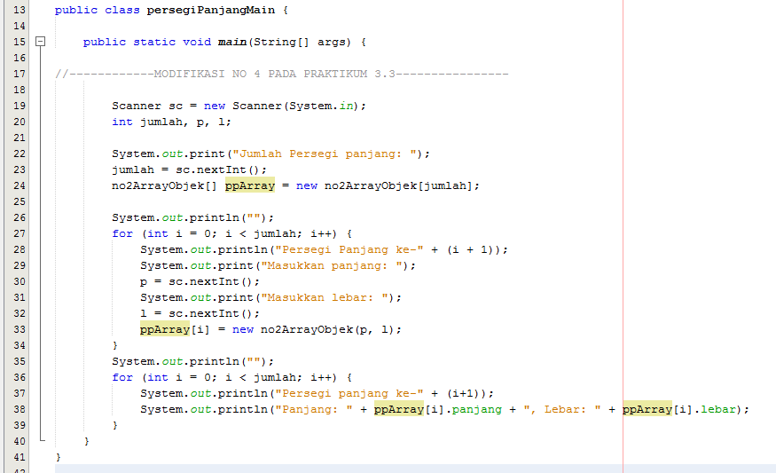

5.	Tidak boleh, karena ppArray[3] itu array yang bersifat statik dan ppArray[i] bersifat dinamik, jika dipanggil maka akan error karena instansiasi dapat dilakukan jika tidak terjadi double array dengan nama array yang sama.

## SUB 3.4.3
1.	Boleh, karena pada beberapa kasus seperti soal pada praktikum studi kasus tanah yang dimana terdapat konstrukstor kosongan (default) dan konstruktor berparameter.
2.	kodingan sesuai perintah no 2
    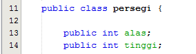
3.	kodingan sesuai perintah no 3
    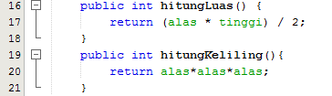
4.	kodingan sesuai perintah no 4
    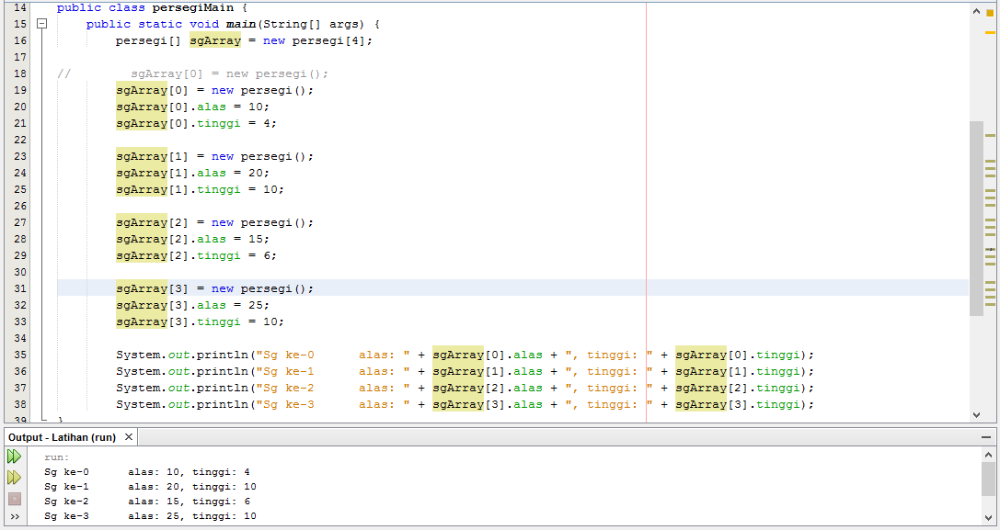
5.  kodingan program no 5
    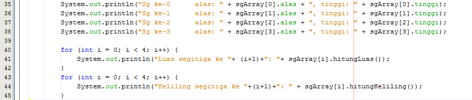
    Output no 5
    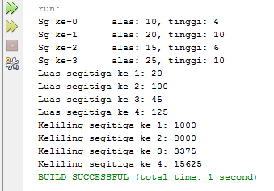
#
# Praktikum Jobsheet 03 (Algoritma & Struktur Data)
## Gambar berikut memuat kodingan class objek, class main dan output
#
1.  * Class objek bangun pertama (balok)
    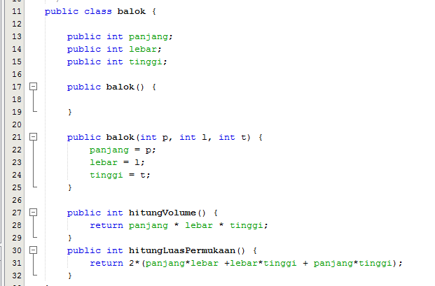
    * Class objek bangun kedua (tabung)
    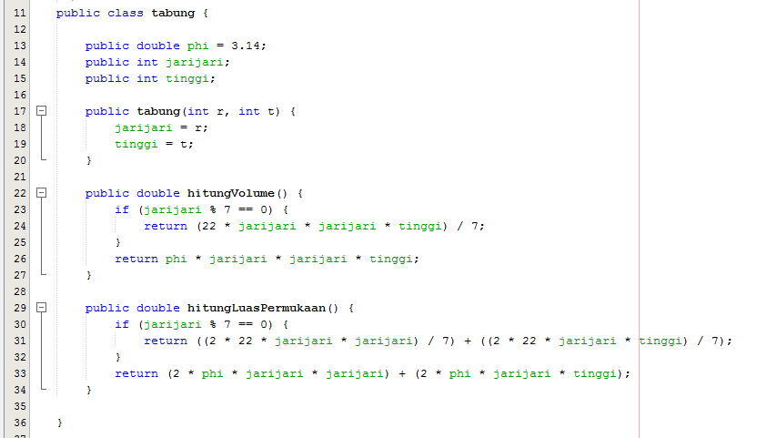
    * Class objek bangun ketiga (kubus)
    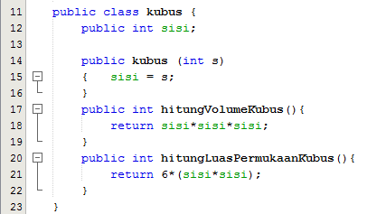
    * Output 
    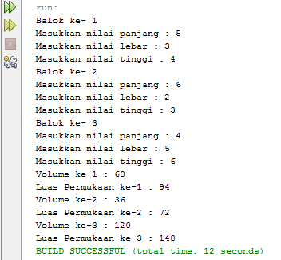

2.   * Class objek Tanah
    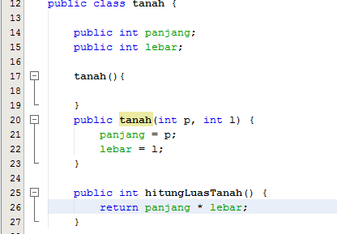
    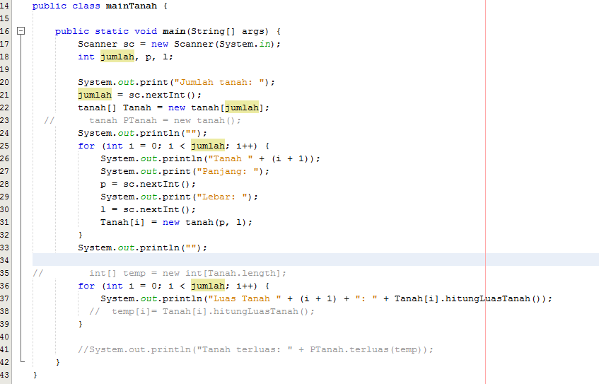
    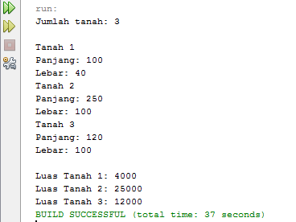
3.  * Class objek Tanah Modifikasi
    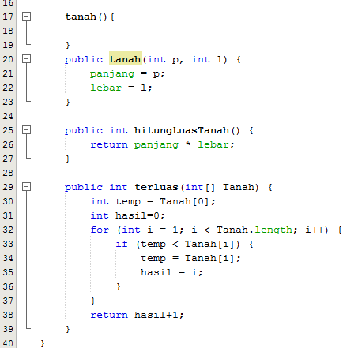
    * Class main Tanah Modifikasi
    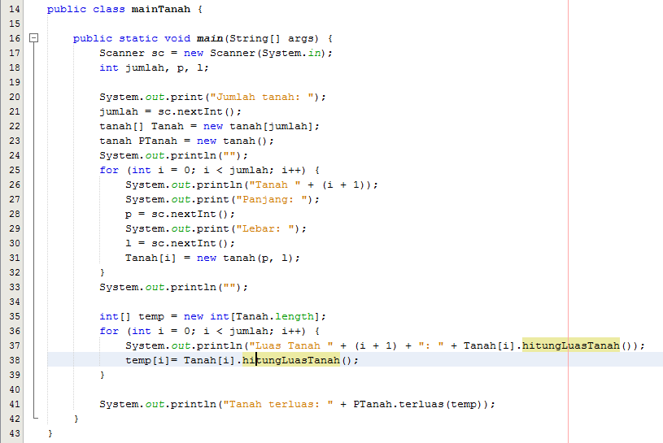
    * Output Modifikasi Tanah
    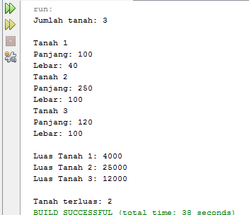
4. * Class Objek Mahasiswa 
    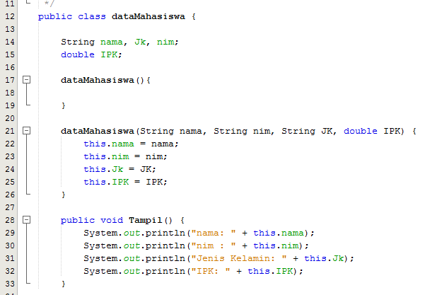
    * Class Main Mahasiswa
    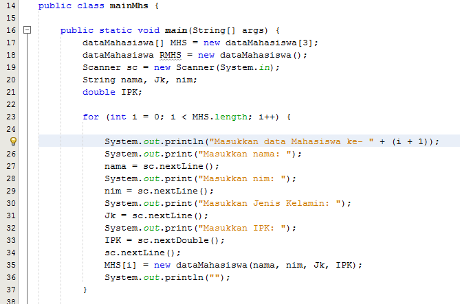
    * Output 
    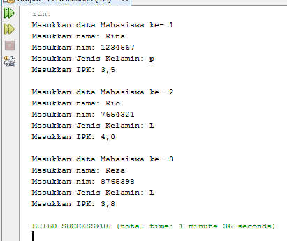
5.  * Class Objek Mahasiswa Modifikasi
    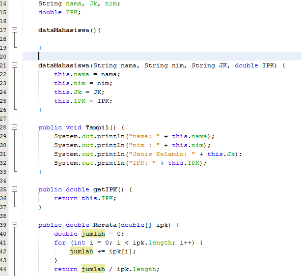
    * Class Main Mahasiswa Modifikasi
    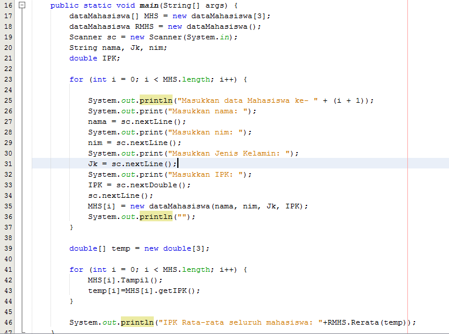
    * Output Modifikasi Mahasiswa
    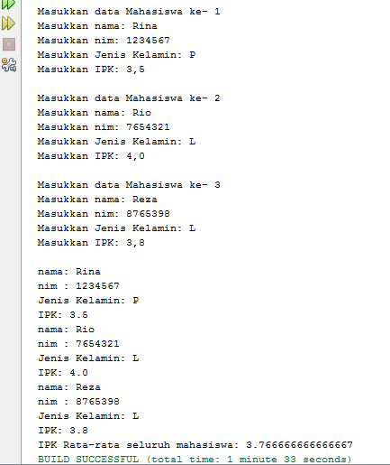

# Terimakasih