# Laporan Jawaban Jobsheet 05
## Pertanyaan 4.2.3
1.	Base line Algoitma Device Conquer 
-	SOLVE : upaya masalah yang berukuran n  if (n == 1)
-	DIVIDE : membagi masalah(nilai faktorial) menjadi beberapa upa-masalah yang memiliki kemiripan dengan masalah semula namun berukuran lebih kecil.
-	CONQUER : menyelesaikan masing-masing upa-masalah tersebut menjadi indenpendent secara rekursif.
-	COMBINE : menggabungkan masing-masing solusi upa-masalah sehingga menjadi solusi dari masalah semula menjadi hasil jawaban.
2.	Iya terdiri dari Devide, Conquer dan Combine. Pada program yang saya buat untuk Devide and Conquer pada baris ke 41 dan Combine pada baris ke 42 pada class Faktorial dengan method faktorialDC()
* 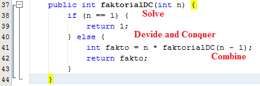
3.	Sepertinya tidak, karena pada method faktorialBF() sebaiknya menggunakan perulangan for untuk menyimpan hitungan perulangan tersebut 
4.	Berikut Programnya :
    * Kode Program di class Faktorial
    * 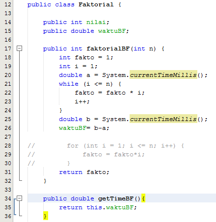
    * Kode Program di class Main Faktorial
    * 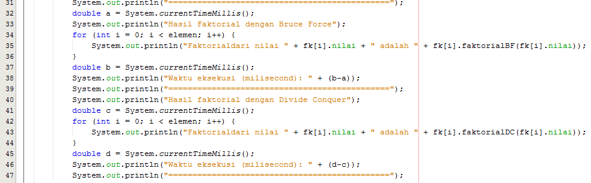
#
## Pertanyaan 4.3.3
1.	Pada pangkatBF() methodnya lebih sederhana dan setelah perulangan for hasil dikalikan dengan a. sedangkan pada pangkatDC() method dibagi menjadi 2 upa-masalah, masing-masing berukuran (a, n/2), upa-masalah pertama berukuran (a, n/2)*a, upa-masalah kedua berukuran (a, n/2).
2.	Potongan program method pangkatDC() tersebut merupakan penyelesaian upa-masalah secara rekursif. Pada program tersebut terdapat kondisi yang mengecek n dimana itu adalah pangkat, jika n==0 maka akan mereturn atau mengembalikan 1. Sedangkan jika tidak maka selanjutnya akan ada kondisi lagi dimana untuk mengecek pangkat lagi, jika (n%2==1) yang artinya pangkat dimodulus 2 sama dengan 1(pangkat merupakan bil ganjil) maka akan mengembalikan nilai dan pangkat dengan nilai dan pangkat dikalikan dengan a (nilai), jika tidak/ else (pangkat merupakan bil genap) maka akan mengembalikan nilai dan pangkat dengan nilai dan pangkat tanpa dikalikan dengan a (nilai)
3.	Iya, tahap combine sudah termasuk dalam kode tersebut. 
4.	Berikut modifikasinya : 
    * 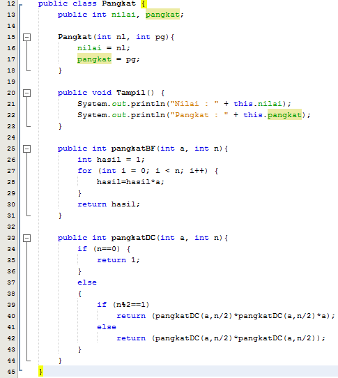
#
## Pertanyaan 4.4.3
1.	Pada method pangkatBF() sistem penyelesaianya menggunakan sistem perulangan yang dimana terdapat perhitungan seperti biasanya. Sedangkan pada method pangkatDC() sistem penyelesaiannya dengan sistem pemecahan elemen nilai menggunakan kondisi tertentu dan kemudian dilakukan perhitungan sesuai kondisi yang tepat lalu digabung kembali menjadi satu elemen nilai.
2.	Cara membatasi output dibelakang koma agar menjadi standar adalah dengan cara menambahkan (int) didepan variabel yang akan diubah.
3.	Formulasi return value tersebut ada karena merupakan sebuah penggabungan list dari penjumlahan total yang ada atau yang telah dibagi-bagi sebelumnya.
4.	Karena untuk menghitung total jumlah dari bilangan-bilangan yang dimasukkan pada untung bulan ke1hingga ke-5 dibutuhkan variabel mid karena perhitungan dilakukan secara linear, yang menghasilkan kompleksitas O(n). Dan cara ini tetap menerapkan teknik rekursif untuk membagi-bagikan masalah menjadi masalah yang lebih kecil. Jika sebelumnya mengharuskan menghitung total keseluruhan list satu persatu, sekarang dapat melakukan perhitungan dengan memecah-mecah list terlebih dahulu.
5.	Dengan membuat array untuk jumlah perusahaan yang akan dihitung sesuai jumlah yang diinginkan.
#
# Praktikum Jobsheet 05 (Algoritma & Struktur Data)
## Gambar berikut memuat kodingan class objek, class main dan output
#
## No 1, 2, dan 3
* Class Algoritma Nilai Mahasiswa 
    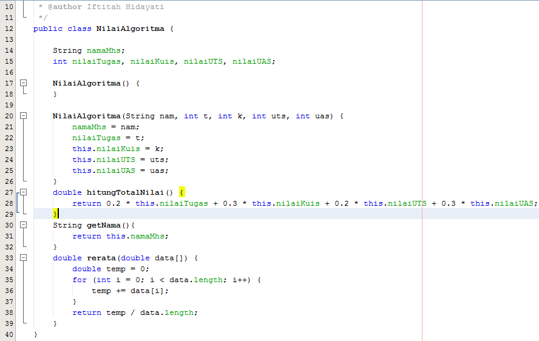
* Class Main Algoritma Nilai Mahasiswa 
    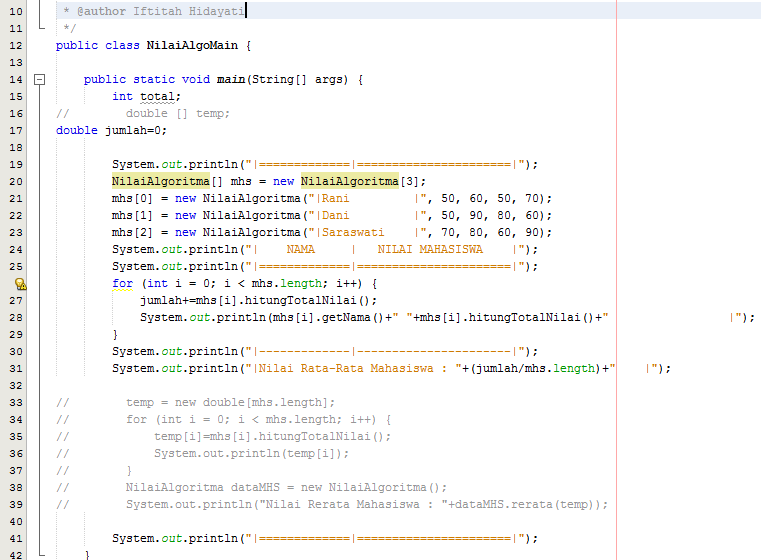
* Output Algoritma Nilai Mahasiswa 
    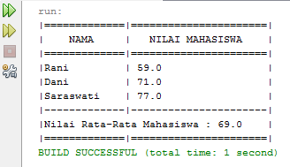
#
## No 4
* Class Pemilihan Ketua BEM
    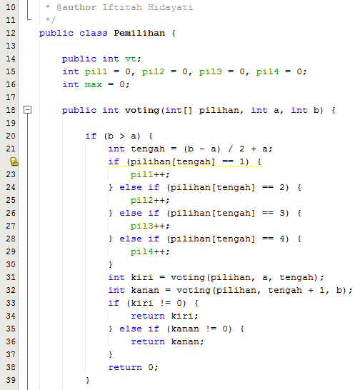
    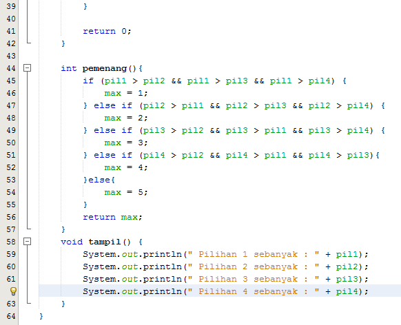
* Class Main Pemilihan Ketua BEM 
    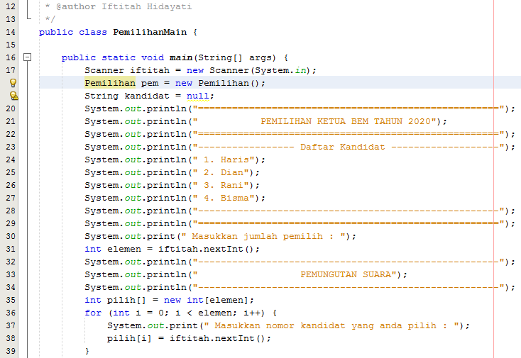
    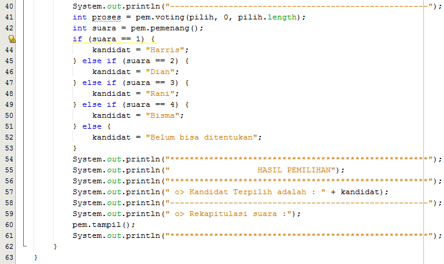
* Output Algoritma Nilai Mahasiswa 
    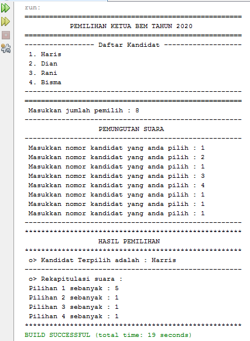
#