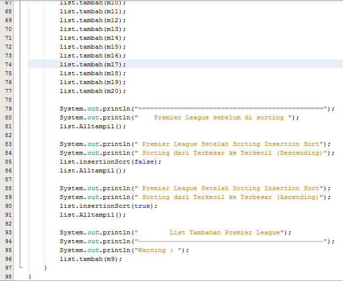

# LAPORAN TUGAS JOBSHEET 06
## Pertanyaan 5.2.3
1.	Pada method bubbleSort() : void
2.	Tidak ada method tersebut
3.	Suatu proses pertukaran nilai pada 2 variabel yang terletak pada baris ke 33-44
* void bubbleSort(){
        for (int i = 0; i < listMhs.length-1; i++) {
            for (int j = 1; j < listMhs.length-i; j++) {
                if (listMhs[j].ipk>listMhs[j-1].ipk) {
                    // ibawah ini proses swap atau pertukan
                    Mahasiswa tmp = listMhs[j];
                    listMhs[j] = listMhs[j-1];
                    listMhs[j-1] = tmp;
                }
            }
        }
    }
4.	Untuk proses swap, dimana membandingkan 2 variabel dalam array. Jika array ini lebih besar daripada array sebelumnya maka di swap.
5.	
    * A.  Perulangan i dan perulangan j yaitu 
        i : perulangan keseluruhan berdasarkan banyak lompatan
        j : perulangan pencarian nilai terbesar dan proses swap.
    * B.  Karena untuk mengetahui perpindahan angka 
    * C.  Karena kondisi tersebut digunakan untuk meletakkan nilai dari indeks array yang diinginkan dan diletakkan di indeks array terakhir, sehingga indeks array terakhir tidak perlu dihiraukan lagi.
	* D.  maka perulangan i akan  berlangsung 49 kali dan ada 49 tahap perulangan yang ditempuh.
## Pertanyaan 5.3.3
Proses ini digunakan untuk mencari nilai terkecil pada indeks array yang digunakan patokan untuk swap.

## Pertanyaan 5.4.3
* 
#
# Praktikum Jobsheet 06 (Algoritma & Struktur Data)
## Gambar berikut memuat kodingan class objek, class main dan output
#
1.  * Class Tiket
    
    * Class Tiket Service
    
    
    * Class Main Tiket 
    
    * Output Tiket
    

2.  * Class Premier League
    
    * Class Premier League Service
    
    
    * Class Main Premier League
    
    
    
    * Class Output Premier League
    
    