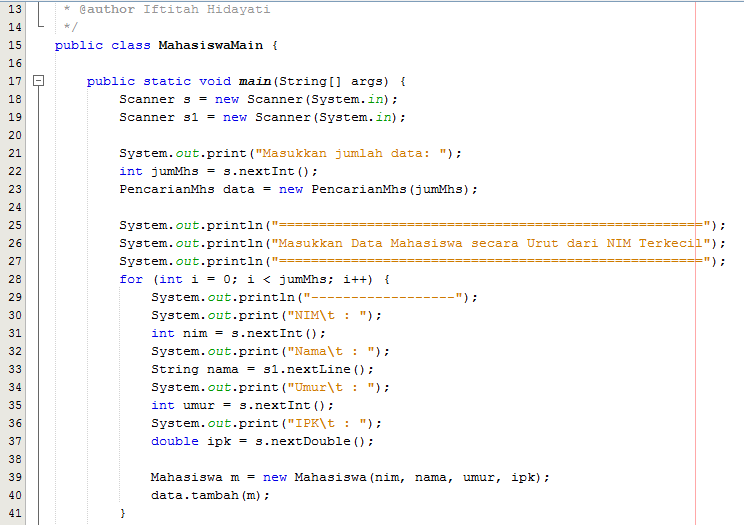
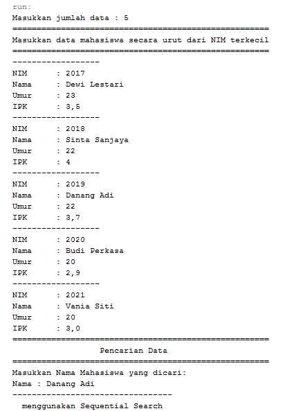

# Laporan Tugas Jobsheet 07
## Pertanyaan 6.2.3

1.	tampilData digunakan untuk menampilkan data pada indeks array yang dicari, sedangkan tampilPosisi digunakan untuk mencari posisi dimana indeks array berada.
2.	fungsi break digunakan untuk menghentikan proses peulangan jika kondisi telah dipenuhi.
3.	Masih dapat berjalan, hasil yang dikeluarkan tetap benar, karena keunggulan dari algoritma sequential itu adalah mambu bekerja walaupun datanya tidak urut.

## Pertanyaan 6.3.3
1.	Kode program proses devide 
    *  
2.	Kode program proses conquer
    *  
3.	Masih bisa berjalan tetapi hasilnya tidak ditemukan, karena bilangan tersebut masih acak.
4.	Hasilnya tidak akan ditemukan, program tidak sesuai dengan sistem binary search dimana data harus acak.
    *  
5.	Modifikasi program supaya jumlah mahasiswa sesuai inputan keyboard
    * 
    *   

#
# Praktikum Jobsheet 07 (Algoritma & Struktur Data)
## Gambar berikut memuat kodingan class objek, class main dan output

1. * Class Mahasiswa 
    
    * Class Pencarian Mahasiswa
    
    
    
    * Class Main Mahasiswa 
    
    
    * Output Mahasiswa1
    
    
#
2. * Class Mahasiswa
    
    * Class Pencarian Mahasiswa
    
    
    
    * Class Main Mahasiswa 
    
    
    * Output Mahasiswa1
    
    
#
3. * Class No3
    
    * Class Main No3 
    
    * Output No3
    
#
4. * Class No4
    
    
    * Class Main No4 
    
    * Output No4
    
