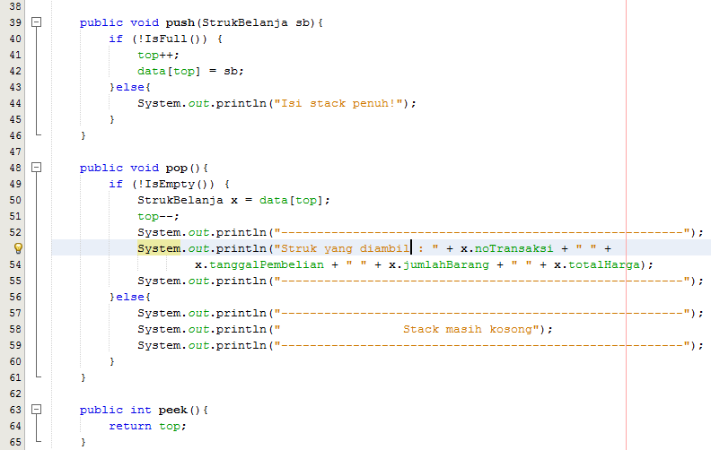

# Laporan Jawaban Jobsheet 09
## Pertanyaan 7.2.3
1.	Fungsi angka 5 pada kode tersebut untuk melakukan instansiasi objek dan 5 adalah nilai parameternya, jadi 5 disini adalah kapasitas penampungan dari stack yang diberi nama stk.
2.	 Penambahan data ke stack sebanyak dua kali, menggunakan angka 18 dan 40.
        * 
    
3.	Karena panjang dari length objek atau nilai parameter objeknya hanya ada 5 dan angka 40 tidak masuk karena nilai parameter atau kapasitas penampungan sudah penuh jadi 40 tidak dimasukkan dalam stack, sedangkan angka 18 bisa masuk kedalam stack karena 18 menggantikan angka 34 yang sudah di pop sebelumnya.
#
## Pertanyaan 7.3.3
1.	Data yang tersimpan pada variabel bk adalah data buku yang memuat parameter judul, nama, tahun, jml, hrg.
2.	Potongan kode program untuk menentukan kapasitas penampungan stack.
    * 
3.	Untuk melakukan penambahan data buku / push data buku secara berkala dengan menggunakan perulangan do-while. Dimana terdapat kondisi y/n, jika memilih y maka perulangan akan menjalankan program penambahan data buku, sedangkan jika memilih n maka perulangan berhenti dan penambahan akan berhenti juga lalu menjalankan program berikutnya.
4.	 Modifikasi kode program pada class StackMain sehingga pengguna dapat memilih operasi
operasi pada stack (push, pop, peek, atau print) melalui pilihan menu program
     * 
     * 
#
## Pertanyaan 7.4.3
1.	Alur atau method derajat ini digunakan untuk mengecek nilai dari operator yang sudah terteraa pada switch case tersebut jika tidak ada maka pengembaliannya 0.
2.	Fungsi kode tersebut untuk mengambil nilai char dari string berdasarkan posisi char di string tersebut.
3.	Jalankan kembali program tersebut, masukkan ekspresi 3*5^(8-6)%3. Tampilkan hasilnya! 
    * 
4.	Tanda kurung tidak ditampilkan pada hasil konversi karena tidak ada kode program untuk menambahkan char tersebut ke String P.
#
# Praktikum Jobsheet 09 (Algoritma & Struktur Data)
## Gambar berikut memuat kodingan class objek, class main dan output
#
1. * Class Stack Kalimat
    
    
    
    * Class Stack Kalimat Main
    
    * Output Stack Kalimat
    
#
2. * Class Stack Belanja
    
    
    * Class Struk Belanja
    
    * Class Main Stack Belanja 
    
    
    * Output Stack Belanja
    
    
    
#